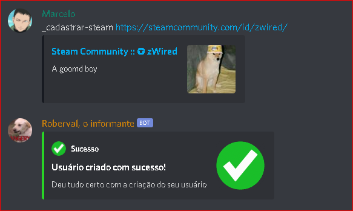
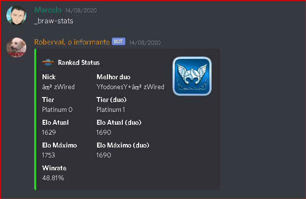
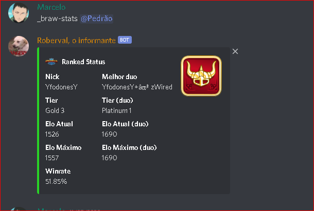

# Roberval Informante
> Bot de Discord que faz de tudo um pouco.

Roberval é um bot de Discord que atualmente busca todas as informações da fila Ranqueada no Brawlhalla

## Exemplo de uso

Primeiro você deve cadastrar sua steam utilizando o comando __cadastrar-steam <linkSteam>

Em seguida, você pode utilizar o comando __cadastrar-steam para consultar suas informações da fila ranqueada:

Você também pode consultar os status de outros usuários que estejam cadastrados utilizando o mesmo comando mas mencionando o usuário em seguida

## Adicionando ao seu servidor

Clique <a href="https://discord.com/oauth2/authorize?client_id=710511669121515691&scope=bot">aqui</a> para adicionar o bot ao seu servidor.
